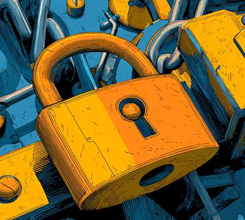

{::nomarkdown}
<h2>Events</h2>
<table style="width:100%; border-style:solid; border-color:#ABB2B9; border-width:thin; border-radius: 8px;">
    <tr>
        <td colspan="2" style='background-color:#F2F3F4; font-weight:700;' id='E1'>Capture The Flag (CTF)</td>
    </tr>
    <tr>
        <td style="vertical-align:top;"></td>
        <td>
            
Test your hacking skills in this year's Capture The Flag competition, created and hosted by Red Mage Security. The CTF features over 20 diverse challenges spanning multiple categories and difficulty levels, from beginner-friendly puzzles to advanced scenarios that will push even experienced competitors to their limits. Whether you're new to CTFs or a seasoned competitor, you'll find challenges that match your skill level in areas like web exploitation, cryptography, forensics, and more. Compete individually or form a team to tackle the challenges, earn points, and climb the leaderboard. Prizes will be awarded to the 1st, 2nd, and 3rd place teams at the end of the day. Come sharpen your skills, learn new techniques, and see how you stack up against fellow security enthusiasts!

            
Registration is available onsite only, so be sure to sign up when you arrive at the conference

        </td>
    </tr>
    <tr>
        <td colspan="2" style='background-color:#F2F3F4; font-weight:700;' id='E2'>Lockpick Village</td>
    </tr>
    <tr>
        <td style="vertical-align:top;"></td>
        <td>
            
 Ready to test your skills? The Lockpick Village is your playground. Explore the world of physical security at our Lockpick Village.

            
Whether you're a complete beginner or experienced enthusiast, you'll get hands-on experience learning how locks work and understanding vulnerabilities in physical security systems. We provide all tools and materials, along with expert guidance to help you pick your first lock or refine your technique. Discover why physical security knowledge is essential for any well-rounded security professional. All skills taught are for educational purposes and ethical security research only.

        </td>
    </tr>
    <tr>
        <td colspan="2" style='background-color:#F2F3F4; font-weight:700;' id='E3'>📞 The Soldering Village (a.k.a. Hardware Hacking Village)</td>
    </tr>
    <tr>
        <td style="vertical-align:top;"></td>
        <td>
            
This year, we decided to phone it in, literally.

            
Grab your iron, take a seat, and put together your retro-inspired badge built around the sounds, tones, and tech that started it all. Afterwards grab up to 3 friends and compete in this year's Official BSidesJAX Badge Challenge, a throwback adventure that blends creativity, electronics, and just a bit of chaos. Be first to complete the challenge and you could earn the ultimate prize, BSidesJAX Black Badges, granting lifetime access to the con and our eternal respect. #badgelife

            
#badgelife

        </td>
    </tr>
    <tr>
        <td colspan="2" style='background-color:#F2F3F4; font-weight:700;' id='E4'>Wireless Village</td>
    </tr>
    <tr>
        <td style="vertical-align:top;"></td>
        <td>
            
Come join us for the fun at the wireless village!  We will have displays and demos for useful wireless projects such as Ham Radios, Meshtastic, APRS, RFID and other devices.  We will also have free testing for ham (ameteur) radio licenses from 1:30 pm to 3:30 pm!  Bring your Meshtastic device, Ham radio, Flipper or other devices to play with at the con.  Remember, don't hack the venue, and be kind to the con, come and have some fun!

            
Ham Radio Testing is from 13:30 to 15:30

        </td>
    </tr>
</table>

{:/}