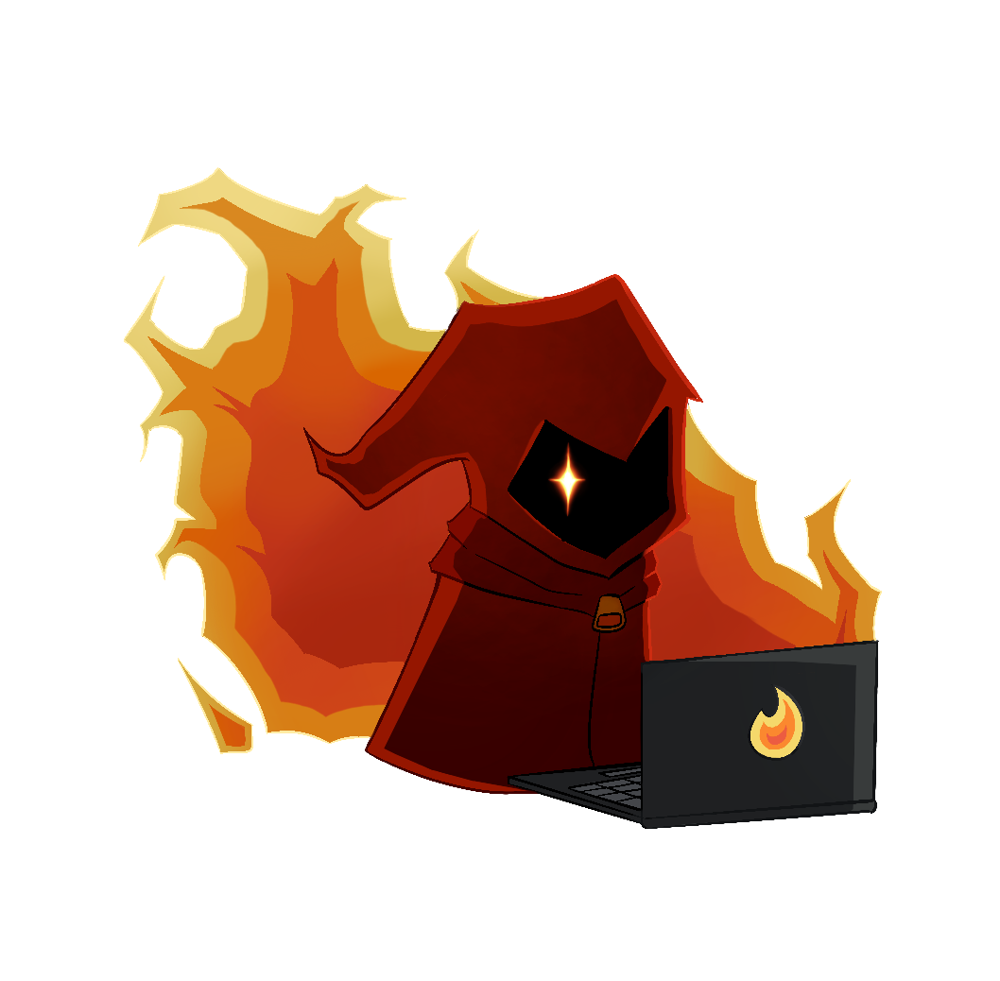
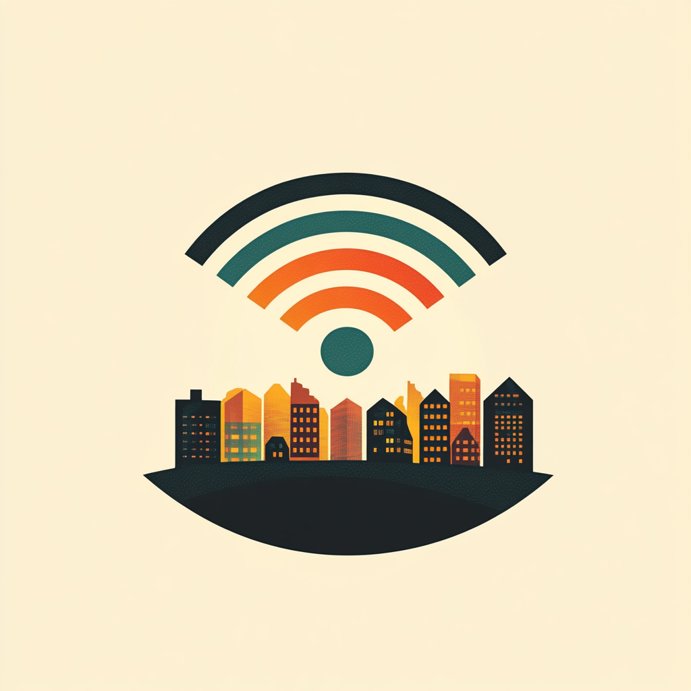

{::nomarkdown}
<h2>Events</h2>
<table style="width:100%; border-style:solid; border-color:#ABB2B9; border-width:thin; border-radius: 8px;">
    <tr>
        <td colspan="2" style='background-color:#F2F3F4; font-weight:700;' id='E1'>Capture The Flag (CTF)</td>
    </tr>
    <tr>
        <td style="vertical-align:top;"></td>
        <td>
            
Join us for this year's competition created by Red Mage Security, the same team that created the awesome 2023 event. The CTF will showcase a diverse range of over 30 challenges with varying difficulties, accross multiple categories, ensuring there's something for everyone, regardless of your skill level.

            
Registration will be availible onsite only. 

        </td>
    </tr>
    <tr>
        <td colspan="2" style='background-color:#F2F3F4; font-weight:700;' id='E2'>Lockpick Village</td>
    </tr>
    <tr>
        <td style="vertical-align:top;"></td>
        <td>
            
Awsome event details will go here
<!-- TODO: Get LockPick Description-->
        </td>
    </tr>
    <tr>
        <td colspan="2" style='background-color:#F2F3F4; font-weight:700;' id='E3'>Soldering Village</td>
    </tr>
    <tr>
        <td style="vertical-align:top;"></td><!-- TODO: Get HHV Pic-->
        <td>
            
The Soldering Village (a.k.a. Hardware Hacking Village) is where you can learn to solder your badge.

            
In celebration of BSidesJAX's 10th anniversary, the artwork and badges this year proudly feature a 10-headed hydra — Us. But this is more than just a symbol; it’s an invitation. You have the chance to meet all 10 of our unique personalities by completing the official badge challenge, Hydra.

            
Prove your skill, solve the challenge first, and you could claim the ultimate prize: a coveted black badge, granting you lifetime access to BSidesJAX and the respect of the entire community.

Do you have what it takes to be truly 31337? #badgelife

        </td>
    </tr>
    <tr>
        <td colspan="2" style='background-color:#F2F3F4; font-weight:700;' id='E4'>Wireless Village</td>
    </tr>
    <tr>
        <td style="vertical-align:top;"></td>
        <td>
            
Come join us for the fun at the wireless village!  We will have displays and demos for useful wireless projects such as Meshtastic, APRS, RFID and others.  We will also have free testing for ham (ameteur) radio licenses from 1:30 pm to 3:30 pm!  Bring your Meshtastic device, Ham radio, Flipper or other devices to play with at the con.  Remember, don't hack the venue, and be kind to the con, come and have some fun!

            
Ham Radio Testing is from 13:30 to 15:30

        </td>
    </tr>
</table>

{:/}