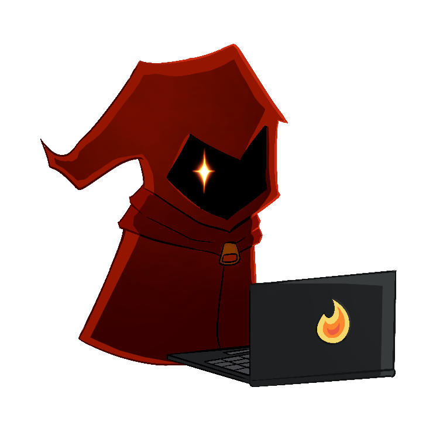
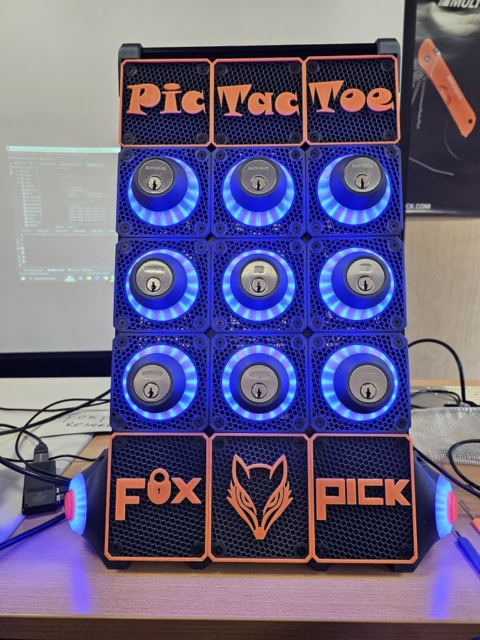
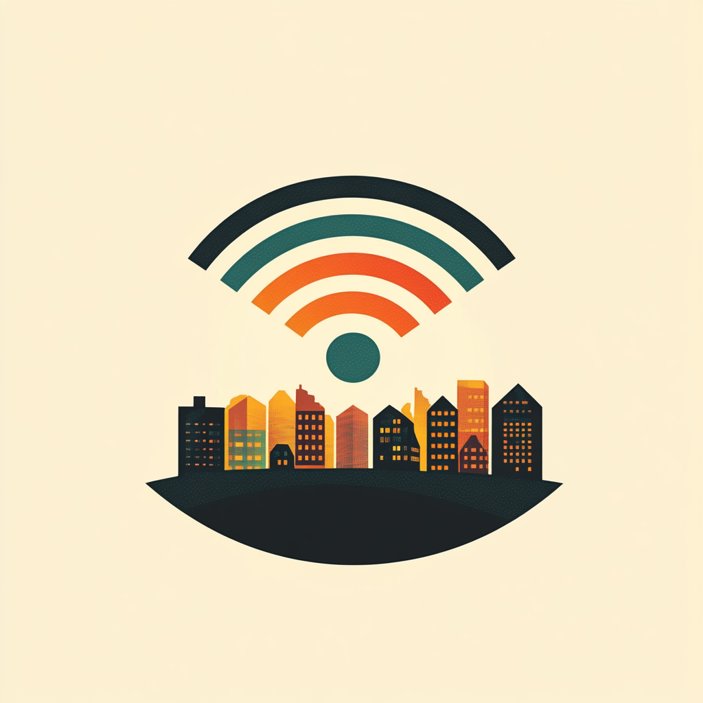

{::nomarkdown}
<h2>Events</h2>
<table style="width:100%; border-style:solid; border-color:#ABB2B9; border-width:thin; border-radius: 8px;">
    <tr>
        <td colspan="2" style='background-color:#F2F3F4; font-weight:700;' id='E1'>Capture The Flag (CTF)</td>
    </tr>
    <tr>
        <td style="vertical-align:top;"></td>
        <td>
            
Join us for this year's competition created by Red Mage Security.

            
The CTF will showcase a diverse range of over 20 challenges with varying difficulties, accross multiple categories, ensuring there's something for everyone, regardless of your skill level.

            
Registration will be available onsite only. 

        </td>
    </tr>
    <!--//
    <tr>
        <td colspan="2" style='background-color:#F2F3F4; font-weight:700;' id='E2'>Lockpick Village</td>
    </tr>
    <tr>
        <td style="vertical-align:top;"></td>
        <td>
            
 Ready to test your skills? The Lockpick Village is your playground. Learn from the pros at <a href="https://twitter.com/fox_pick">@Fox_Pick</a>, try your luck at various locks, and discover the secrets behind physical security. It's a fun and informative way to bolster your security expertise."Here you could learn how to pick locks and participate in fun contests.

        </td>
    </tr>
    -->
    <tr>
        <td colspan="2" style='background-color:#F2F3F4; font-weight:700;' id='E3'>📞 The Soldering Village (a.k.a. Hardware Hacking Village)</td>
    </tr>
    <tr>
        <td style="vertical-align:top;"></td>
        <td>
            
This year, we decided to phone it in, literally.

            
Grab your iron, take a seat, and put together your retro-inspired badge built around the sounds, tones, and tech that started it all. Afterwards grab up to 3 friends and compete in this year's Official BSidesJAX Badge Challenge, a throwback adventure that blends creativity, electronics, and just a bit of chaos. Be first to complete the challenge and you could earn the ultimate prize, BSidesJAX Black Badges, granting lifetime access to the con and our eternal respect. #badgelife

            
#badgelife

        </td>
    </tr>
    <tr>
        <td colspan="2" style='background-color:#F2F3F4; font-weight:700;' id='E4'>Wireless Village</td>
    </tr>
    <tr>
        <td style="vertical-align:top;"></td>
        <td>
            
Come join us for the fun at the wireless village!  We will have displays and demos for useful wireless projects such as Ham Radios, Meshtastic, APRS, RFID and other devices.  We will also have free testing for ham (ameteur) radio licenses from 1:30 pm to 3:30 pm!  Bring your Meshtastic device, Ham radio, Flipper or other devices to play with at the con.  Remember, don't hack the venue, and be kind to the con, come and have some fun!

            
Ham Radio Testing is from 13:30 to 15:30

        </td>
    </tr>
</table>

{:/}