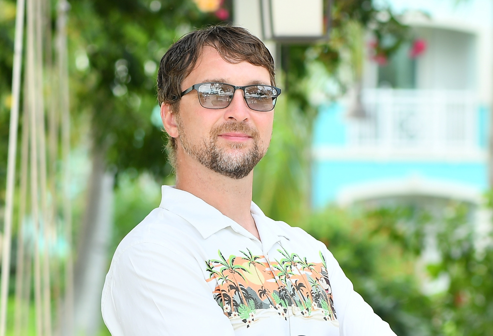
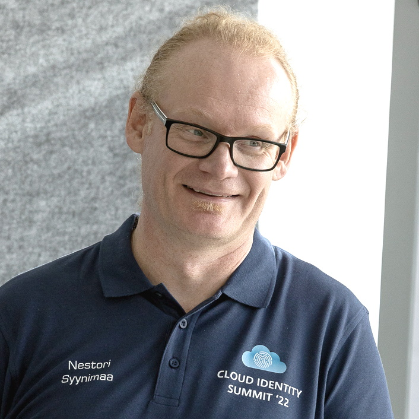
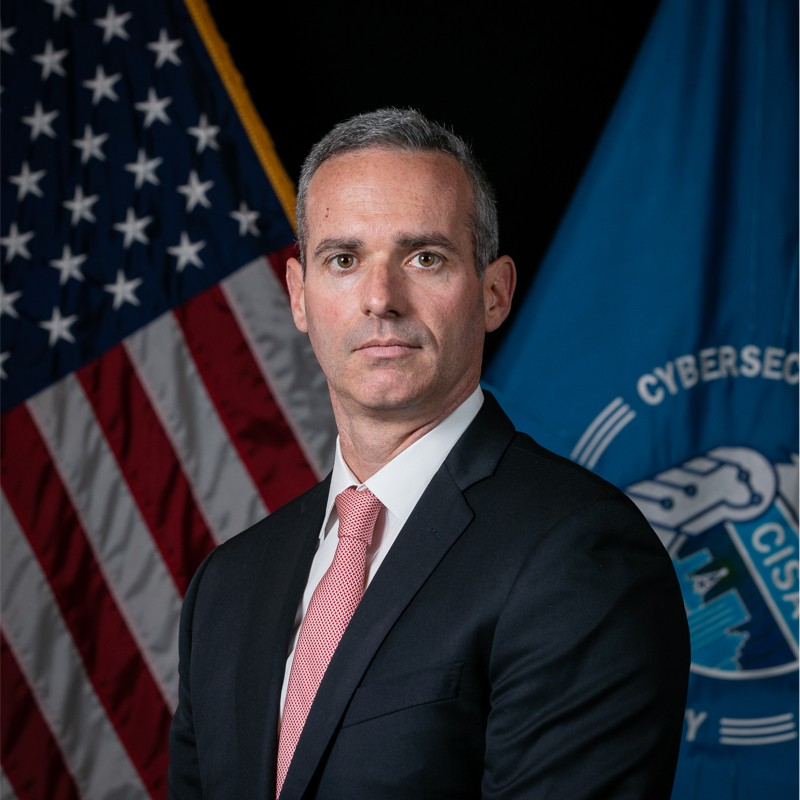

{::nomarkdown}
<h2>Keynote Speaker</h2>
<table style="width:100%; border-style:solid; border-color:#ABB2B9; border-width:thin; border-radius: 8px;">
    <tr>
        <td colspan="2" style='background-color:#F2F3F4; font-weight:700;' id='K1'>Jayson E. Street</td>
    </tr>
    <tr>
        <td style="vertical-align:top;"></td>
        <td>
            
<b>Jayson E. Street referred to in the past as:</b> A "notorious hacker" by FOX25 Boston, "World Class Hacker" by National Geographic Breakthrough Series and described as a "paunchy hacker" by Rolling Stone Magazine. He however prefers if people refer to him simply as a Hacker, Helper & Human.

            
He's a Simulated Adversary for hire. The author of the "Dissecting the hack: Series" (which is currently required reading at 5 colleges in 3 countries that he knows of). Also the DEF CON Groups Global Ambassador. He's spoken at DEF CON, DEF CON China, GRRCon, DerbyCon at several other 'CONs & colleges on a variety of Information Security subjects. He was also a guest lecturer for the Beijing Institute of Technology for 10 years.

            
He loves to explore the world & networks as much as he can. He has successfully robbed banks, hotels, government facilities, Biochemical companies, etc.. on five continents (Only successfully robbing the wrong bank in Lebanon once all others he was supposed to)!

            
*He is a highly carbonated speaker who has partaken of Pizza from Bulgaria to Brazil & China to The Canary Islands. He does not expect anybody to still be reading this far but if they are please note he was proud to be chosen as one of Time's persons of the year for 2006.

            
More about Jayson can be found at his website: <a href="https://jaysonestreet.com" target="_blank">https://jaysonestreet.com</a>

            
<b>Talk: </b><a href="/schedule/#K1">Keynote Address</a>

        </td>
    </tr>
</table>
<h2>Speakers</h2> <!-- in alphabetical order //-->
<table style="width:100%; border-style:solid; border-color:#ABB2B9; border-width:thin; border-radius: 8px;">
    <tr>
        <td colspan="2" style='background-color:#F2F3F4; font-weight:700;' id='S1'>@Astacilauskas</td>
    </tr>
    <tr>
        <td style="vertical-align:top;"></td>
        <td>
            
With over 23 years of experience in incident response and a solid educational background, including a master's degree in information technology management from Webster University and a bachelor's degree in information technology from Central Michigan University, I have expertise spans threat hunting, cyber threat analysis, incident detection, and rapid mitigation, supported by eight GIAC and CISSP certifications in the areas of digital forensics, network security monitoring, and cyber security engineering.

            
My commitment to knowledge sharing and thought leadership is a reflection of my deep passion for the field and my strong desire to drive innovation within the industry. In addition to my blog, I have had the privilege of speaking at BSides NOVA and on the podcast Paul's Security Weekly Unlocked, further fueling my motivation to contribute to the cybersecurity community.

            
<b>Talk: </b><a href="/schedule/#T1">AL, AI, and Sigma: Automating Threat Hunting With OpenAI</a>

        </td>
    </tr>
    <tr>
        <td colspan="2" style='background-color:#F2F3F4; font-weight:700;' id='S2'>Brandi Kiehl</td>
    </tr>
    <tr>
        <td style="vertical-align:top;"></td>
        <td>
            
Brandi is a business co-owner and philanthropist who enjoys teaching, helping people discover their potential, mentoring etc. Currently Co-Organizes the Women in Technology of Jacksonville Group, PyJax (Python of Jacksonville), BSidesJax IT Security Conference and Florida IT Professionals groups. She is also on the Jacksonville MOSH Planetarium Planning Board, the Duval County Amateur Radio Emergency Services Assistant Coordinator as well as on several Amateur Radio Boards and Volunteer Examiner Radio Licensing.

            
An experienced IT professional, data scientist, analyst, and management experience (10+ years of project management experience). Other skills include digital marketing, digital content creation, web applications, web development, photography, engineering and coding.

            
<b>Talk: </b><a href="/schedule/#T12">Using Analytics to hack Applicant Tracking Systems (ATS)</a>

        </td>
    </tr>
    <tr>
        <td colspan="2" style='background-color:#F2F3F4; font-weight:700;' id='S3'>Champ Clark</td>
    </tr>
    <tr>
        <td style="vertical-align:top;"></td>
        <td>
            
Champ Clark III is the Chief Technology Officer at Quadrant Information Security and the creator of the Sagan log analysis engine (https://github.com/quadrantsec/sagan). He has presented at Defcon, Chaos Computer Club “Congress”, Suricon, ISSA events, multiple B-Sides, and more. He is also an author, father, and musician. Champ recently started a new venture known as Key9 (https://k9.io) which merges Passkeys and Identity and Access Management.

            
<b>Talk: </b><a href="/schedule/#T9">Passkeys: The Good, the Bad and the Ugly</a>

        </td>
    </tr>
    <tr>
        <td colspan="2" style='background-color:#F2F3F4; font-weight:700;' id='S4'>Christian McLaughlin</td>
    </tr>
    <tr>
        <td style="vertical-align:top;"></td>
        <td>
            
Christian McLaughlin is an Information Security Professional with 5 years of experience in offensive and defensive cybersecurity operations. As a U.S. Navy veteran, he served honorably for 8 years as an Aviation Electrician's Mate in the Maritime Patrol and Reconnaissance Aircraft (MPRA) community, working on P-3C "Orion" and P-8A "Poseidon" aircraft.

            
In 2019, he transitioned from a career in Naval Aviation to a career in Information Security in the private sector. His roles have included working as a SOC Analyst in a Security Operations Center, performing security consultation services for offensive security assessments as a Penetration Tester, and working as a Security Engineer with a strong focus on Cloud Security, DevSecOps, Incident Response, and Vulnerability Management.

            
He currently serves as a Senior Security Engineer at ChenMed, a healthcare company that focuses on preventative medical care for Medicare-eligible senior citizens.

            
He is an advocate for hands-on learning, placing heavy emphasis on creating a personal "home lab" and exploring self-hosted solutions for learning. He is a community leader who actively participates in various local groups, including JAX2600/DC904, JaxLUG (Linux User Group), PyJax (Python User Group), the Jacksonville OWASP Chapter, and BSides Jax. He is also a public speaker and has given talks at several conferences, including BSides Orlando and HOPE.

            
<b>Talk: </b><a href="/schedule/#T6">Lets Build a Soc Puppet: Standing Up Your Own Security Operations Center at Home</a>

        </td>
    </tr>
    <tr>
        <td colspan="2" style='background-color:#F2F3F4; font-weight:700;' id='S5'>Craig Galley</td>
    </tr>
    <tr>
        <td style="vertical-align:top;"></td>
        <td>
            
Former CISO - City of Jacksonville and current Security Architect at JEA

            
<b>Talk: </b><a href="/schedule/#T5">API Security Fundamentals</a>

        </td>
    </tr>
    <tr>
        <td colspan="2" style='background-color:#F2F3F4; font-weight:700;' id='S6'>DrAzureAD</td>
    </tr>
    <tr>
        <td style="vertical-align:top;"></td>
        <td>
            
Dr Nestori Syynimaa is a Principal Identity Security Researcher at Microsoft Threat Intelligence Center (MSTIC). He has over a decade of experience with the security of Microsoft cloud services and is known as the creator of the AADInternals toolkit. Before joining Microsoft in early 2024, Dr Syynimaa worked as a researcher, CIO, consultant, trainer, and university lecturer for over 20 years.

            
<b>Talk: </b><a href="/schedule/#T10">Exploiting Token Based Authentication: Attacking and Defending Identities in the 2020s</a>

        </td>
    </tr>
    <tr>
        <td colspan="2" style='background-color:#F2F3F4; font-weight:700;' id='S7'>Jennifer Shannon</td>
    </tr>
    <tr>
        <td style="vertical-align:top;"></td>
        <td>
            
Jennifer is a Senior Security Consultant with Secure Ideas with a background in malware analysis, penetration testing, and teaching. She graduated with honors from Florida State College at Jacksonville’s networking program. An avid computer geek for most of her life, she began her journey in cybersecurity as a SOC Analyst where she showed an aptitude for both penetration testing and malware analysis. She was quickly promoted into a role that capitalized on her abilities. She has experience performing penetration tests against web applications, mobile software and platforms, and social engineering.

            
Jennifer discovered a passion for computers and problem solving at a young age. She bought Steal This Computer Book 2.0, by Wallace Wang, with one of her first paychecks, and became enamored with hacking and cyber security. While pursuing her degree she dedicated time to teaching computing skills to underrepresented minorities. She is the co-leader for the TOOOL chapter in Jacksonville, FL. Jennifer continues to be passionate about teaching and is eager to share her knowledge with anyone who will listen.

            
In her free time, she likes gaming, playing around with SDR’s, and painting.

            
<b>Talk: </b><a href="/schedule/#T2">Tales From The Vault</a>

        </td>
    </tr>
    <tr>
        <td colspan="2" style='background-color:#F2F3F4; font-weight:700;' id='S8'>Kirby Wedekind</td>
    </tr>
    <tr>
        <td style="vertical-align:top;"></td>
        <td>
            
Kirby Wedekind serves as the Department of Homeland Security’s Protective Security Advisor for northeast Florida. He is responsible for outreach, engagement, and coordination with the local critical infrastructure community –  including private industry, academia, non-profit organizations, and government agencies – to reinforce cybersecurity, physical security, and resilience initiatives. He is a task force officer assigned to FBI Jacksonville’s Cyber Task Force and chairman of the advisory board for Jacksonville University’s Department of Computing Science & Center of Cybersecurity. Dr. Wedekind is a Jacksonville native who previously served for 10 years in the US Marines with combat deployments to Iraq (2009), Afghanistan (2011-2012), and with the 22nd Marine Expeditionary Unit (2016). He holds a B.A. in English from Wake Forest University, an Executive Master’s degree from Georgetown University in Emergency and Disaster Management, and doctorate (PhD) in Defence and Security from Cranfield University at the Defence Academy of the United Kingdom.

            
<b>Talk: </b><a href="/schedule/#T14">Secure by Demand</a>

        </td>
    </tr>
    <tr>
        <td colspan="2" style='background-color:#F2F3F4; font-weight:700;' id='S9'>Nathan Hamiel</td>
    </tr>
    <tr>
        <td style="vertical-align:top;"></td>
        <td>
            
Nathan Hamiel is Senior Director of Research at Kudelski Security, where he leads the fundamental and applied research team, part of the Innovation group working to define the future of the company’s products and services. He focuses on emerging and disruptive technologies and their intersection with information security. This research includes new approaches to difficult security problems and the safety, security, and privacy of artificial intelligence. Nathan is passionate about risks at the intersection of technology and humanity and shares his thoughts on his blog, Perilous.tech. During his nearly 25 years in cybersecurity, he has been a regular public speaker, presenting his research at global security events, including Black Hat, DEF CON, HOPE, ShmooCon, SecTor, ToorCon, and many others. He is also a veteran member of the Black Hat review board, serving as the AI, ML, and Data Science track lead.

            
<b>Talk: </b><a href="/schedule/#T8">Alice in Generative AI Land</a>

        </td>
    </tr>
    <tr>
        <td colspan="2" style='background-color:#F2F3F4; font-weight:700;' id='S14'>Philippe Caturegli </td>
    </tr>
    <tr>
        <td style="vertical-align:top;"></td>
        <td>
            
Philippe has over 25 years of experience in building, defending, and attacking across all areas of Information Security. He's been performing penetration tests since the early 2000s, gaining deep expertise across diverse security landscapes. In 2012, he founded Seralys, a boutique cybersecurity company specializing in high value add penetration testing engagements, serving clients in both Europe and North America.

            
Before Seralys, Philippe was a Senior Manager at a Big 4 firm in Luxembourg, where he led Security & Privacy engagements, primarily with financial institutions. Earlier in his career, he held several roles within the information system security department of a global pharmaceutical company in London, managing a heterogeneous network of over 100,000 users under strict regulatory requirements.

            
<b>Talk: </b><a href="/schedule/#T16">Internal Domain Name Collision 2.0</a>

        </td>
    </tr>
    <tr>
        <td colspan="2" style='background-color:#F2F3F4; font-weight:700;' id='S10'>Ralph Hittell</td>
    </tr>
    <tr>
        <td style="vertical-align:top;"></td>
        <td>
            
As the Lead Offensive Security Engineer at Grainger, I specialize in penetration testing, advanced threat hunting, and validating detection controls. My role involves simulating high-risk threats, managing third-party security engagements, and enhancing our cybersecurity posture through continuous improvement and strategic defense initiatives.

            
<b>Talk: </b><a href="/schedule/#T13">From Intelligence to Action: CTI-Driven Red Teaming</a>

        </td>
    </tr>
    <tr>
        <td colspan="2" style='background-color:#F2F3F4; font-weight:700;' id='S11'>Rebecca Hughes</td>
    </tr>
    <tr>
        <td style="vertical-align:top;"></td>
        <td>
            
With over a decade of experience in storytelling with data, analytics and compliance, Rebecca Hughes has a proven track record of identifying inefficiencies and bottlenecks, and developing innovative tools to mitigate them. Leveraging a Master’s in Forensic Psychology from Arizona State, she works to bring a human element to the world of Cybersecurity, and believes that understanding the person behind the program is the key to a strong security posture. Although she enjoys a hands-on work experience, she views her greatest role as being a people leader and culture champion.

            
Currently she is responsible for developing and implementing an efficient and strong IT Governance, Risk, and Compliance (GRC) program at VyStar CU, where she also oversees all aspects of Security Awareness training. This professional challenge engaged her passion to see the motive behind the method and has energized her to develop a top-tier Security Awareness program that brings evidence-based methodology together with engaging training resources.

            
<b>Talk: </b><a href="/schedule/#T15">Cyber Psychology: Harnessing Behavioral Analysis for Security Awareness</a>

        </td>
    </tr>
    <tr>
        <td colspan="2" style='background-color:#F2F3F4; font-weight:700;' id='S12'>Roland Heintze</td>
    </tr>
    <tr>
        <td style="vertical-align:top;"></td>
        <td>
            
A senior developer & technical lead that works in DevSecOps & application development for federal agencies.

            
<b>Talk: </b><a href="/schedule/#T3">Developer & Hacker Harmony: The Nuances of Cybersecurity</a>

        </td>
    </tr>
    <tr>
        <td colspan="2" style='background-color:#F2F3F4; font-weight:700;' id='S13'>Tony Drake</td>
    </tr>
    <tr>
        <td style="vertical-align:top;"></td>
        <td>
            
Tony Drake has over 25 years of experience in information security and systems administration. He has worked in roles ranging from systems design and administration to incident response, tactical intelligence, and managing pen tests. He has worked for the last 20 years in various roles in financial firms including brokerage, banking, exchange and payments in roles ranging from jack-of-all-trades "security guy" to tactical intelligence and malware analysis. He has worked in all aspects of Pen Testing from scoping, and planning to managing results, to incident response. In his current role he serves as lead security researcher for the Intercontinental Exchange, solving tactical security problems with creative solutions.

            
He holds a CISSP as well as SANS certifications in Incident Response, Web Application Pen Testing, Network Pen Testing and Threat Intelligence, and OSINT.

            
<b>Talk: </b><a href="/schedule/#T11">Incident Response for the Ovewhelmed, Understaffed and Unprepared</a>

        </td>
    </tr>
</table>

{:/}