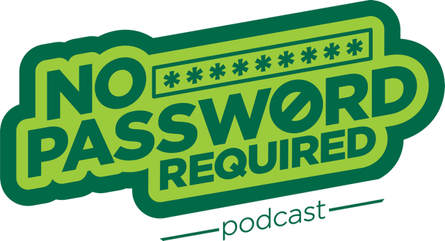
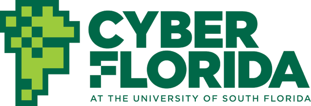

We're excited to announce that the crew from Cyber Florida's popular "No Password Required" podcast will be joining us at BSides Jacksonville on November 15th for a special live recording session!

## What to Expect

The No Password Required team will be setting up shop right at the event to capture all the energy and insights that make BSides Jacksonville such a unique gathering in the cybersecurity community. This won't be your typical podcast episode – they'll be diving deep into what makes BSides special, the conversations happening in the hallways, and the innovative ideas being shared throughout the day.

## Featuring Our Keynote Speaker

The highlight of their recording will be an in-depth conversation with this year's keynote speaker, Gina Yacone. Known for her expertise and engaging speaking style, Gina will share her insights not just from her keynote presentation, but also her perspectives on the current state of cybersecurity, emerging trends, and what she's observed from the BSides community.

## Why This Matters

BSides events have always been about community, knowledge sharing, and breaking down barriers in cybersecurity education. Having the No Password Required podcast document our event means these conversations and insights will reach an even broader audience, extending the impact of BSides Jacksonville far beyond November 15th.

Whether you're a regular listener of No Password Required or discovering them for the first time, this is a fantastic opportunity to see podcast magic happen in real time while being part of the vibrant BSides Jacksonville community.

## Mark Your Calendar

**When:** November 15th  
**Where:** BSides Jacksonville  
**What:** Live podcast recording featuring BSides Jacksonville and keynote speaker Gina Yacone  

Don't miss this unique intersection of cybersecurity education, community building, and media – it's going to be an episode worth experiencing live and listening to later!
Stay tuned for more details about timing and location within the event. See you at BSides Jacksonville!

---

